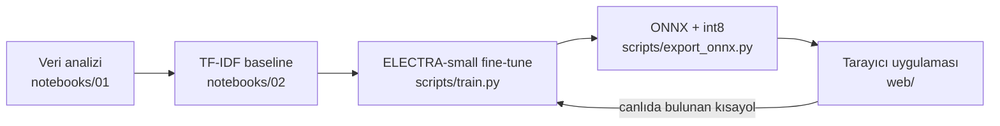

# Türkçe Duygu Analizi — Tarayıcıda Çalışan Model

Türkçe metinleri **olumlu / olumsuz / nötr** olarak sınıflandıran, tamamen **tarayıcıda** (WebGPU veya WASM) çalışan bir model. Metin hiçbir sunucuya gönderilmez.

**🔗 Canlı demo:** https://ayse-solmaz.github.io/turkish-sentiment-analysis/

**🤗 Model:** https://huggingface.co/ayse-solmaz/turkish-sentiment-electra-small

Proje uçtan uca bir ML hattıdır: veri analizi → baseline → fine-tuning → ONNX + int8 quantization → tarayıcıda çıkarım ve ölçüm.



## Öne çıkan bulgular

### 1. Veri setinde bir kısayol vardı
[winvoker/turkish-sentiment-analysis-dataset](https://huggingface.co/datasets/winvoker/turkish-sentiment-analysis-dataset) (440 bin örnek) incelendiğinde nötr sınıfının **tamamının Wikipedia'dan** geldiği ve cümlelerin **%98.8'inin `" ."` (boşluk + nokta)** ile bittiği görüldü. Diğer sınıflarda bu oran %1'in altında.

Bu, bir modelin "nötr" kavramını değil, **noktalama hatasını** öğrenebileceği anlamına geliyor (*shortcut learning*).

### 2. Stres testi kısayolu kanıtladı
Test setinde yalnızca noktadan önceki boşluk silindi (`"geçti ."` → `"geçti."`). Cümlelerin anlamı değişmedi:

| Model | Normal test (macro F1) | Stres testi (macro F1) | Nötr recall (stres) |
|---|---|---|---|
| TF-IDF, ham veri | 0.917 | **0.706** 📉 | 0.996 → **0.390** |
| TF-IDF, temizlenmiş veri | 0.912 | 0.912 ✅ | 0.989 |

Yüksek test skoru, modelin doğru şeyi öğrendiğini garanti etmiyor.

### 3. Önceden eğitilmiş model gerçek hayatta daha iyi genelleşiyor
Temizlenmiş veriyle ELECTRA-small fine-tune edildi ve günlük nötr cümlelerle (*"Kargo bugün geldi."*, *"Ürün mavi renkte."* …) test edildi:

| Model | Test macro F1 | Gerçek hayat nötr testi |
|---|---|---|
| TF-IDF (temiz) | **0.912** | 2 / 6 |
| ELECTRA-small | 0.893 | **5 / 6** |

Test skoru TF-IDF'i öne çıkarıyor, ama test setinin kendisi yanlı olduğu için gerçek kullanımı ölçmüyor. ELECTRA'nın düşük kalan noktası olumsuz sınıfın precision değeri (0.645): dengeli eğitim nedeniyle model olumsuz sınıfı gerçekte olduğundan sık tahmin ediyor (*prior shift*).

### 4. Canlıda ikinci bir kısayol bulundu → model v2
Yayındaki uygulamada *"bugün hava çok bulutluydu."* **olumlu** çıkarken *"**B**ugün hava çok bulutluydu."* **%99.9 nötr** çıktı. Veride ölçüldüğünde nötr cümlelerin **%100'ünün** büyük harfle başladığı görüldü (olumsuz: %29, olumlu: %8). Model, cümlenin ilk harfine bakarak karar veriyordu.

Girdinin ilk harfini otomatik büyütmek denendi ama sorunu yalnızca taşıdı (*"Tavsiye ederim"* olumsuz çıktı). Bunun yerine model v2 eğitildi:
- **İlk harf augmentation:** eğitimde ilk harf rastgele büyütülüp küçültüldü, böylece harf tipi sınıf hakkında bilgi taşımadı.
- **Prior düzeltmesi:** dengeli eğitimin etkisi, gerçek sınıf oranlarına göre son katmanın bias'ı ayarlanarak giderildi.

| | v1 | **v2** |
|---|---|---|
| Macro F1 | 0.893 | **0.908** |
| Macro F1 — tüm ilk harfler küçük | 0.695 📉 | **0.908** |
| Macro F1 — tüm ilk harfler büyük | 0.877 | **0.908** |
| Negative precision | 0.645 | **0.781** |
| Günlük nötr cümleler (küçük / büyük harf) | 0/8 · 7/8 | 4/8 · 5/8 |

v2 harf tipinden etkilenmiyor. Günlük nötr testte v1'in büyük harfli 7/8'i kısayola dayanıyordu; v2'nin 4–5/8'i dürüst skor. Kalan hatalar ürün yorumu dilindeki nötr cümlelerde (*"Fiyatı 200 TL."*): eğitim verisinde bu dildeki cümlelerin neredeyse hepsi olumlu. Bu, yalnızca gerçekçi nötr veriyle çözülebilir.

### 5. int8 quantization: 4 kat küçük, neredeyse aynı doğruluk

| Model | Boyut | PyTorch ile aynı tahmin | Doğruluk (500 cümle) |
|---|---|---|---|
| ONNX fp32 | 55 MB | %100 | %92.4 |
| ONNX int8 | **14 MB** | %98.6 | %92.2 |

### 6. Küçük modelde WebGPU, CPU'dan yavaş
Tarayıcıda tek cümle, 5 ısınma turu + 50 ölçüm (Intel Arc dahili GPU, Chrome):

| Ortam | İlk çalıştırma | Medyan | p95 |
|---|---|---|---|
| WebGPU · fp32 | 120 ms | 51.2 ms | 55.4 ms |
| **WASM (CPU) · int8** | 4.7 ms | **4.3 ms** | 5.2 ms |
| WASM (CPU) · fp32 | 7.9 ms | 7.6 ms | 8.7 ms |

14M parametrelik bir model için GPU'ya veri gönderip sonucu geri almanın sabit maliyeti, hesaplamanın kendisinden büyük. WebGPU büyük modellerde ve toplu işlemede öne geçer; bu boyutta **int8 + WASM** en iyi seçim.

## Proje yapısı

```
notebooks/
  01_veri_kesfi.ipynb     # veri analizi, kısayolun tespiti
  02_baseline.ipynb       # TF-IDF baseline ve stres testi
scripts/
  download_data.py        # veri setini indirir
  common.py               # ortak temizlik fonksiyonları ve test seti
  train.py                # ELECTRA-small fine-tuning (CPU), v2
  evaluate.py             # modelleri stres testleriyle karşılaştırır
  export_onnx.py          # ONNX'e çevirme, int8, doğrulama
web/
  index.html, app.js      # tarayıcı uygulaması (Transformers.js)
```

## Çalıştırma

```powershell
python -m venv .venv
.venv\Scripts\Activate.ps1
pip install -r requirements.txt

python scripts/download_data.py   # veri (~85 MB)
python scripts/train.py           # eğitim (CPU'da ~35-40 dk)
python scripts/evaluate.py        # stres testleri
python scripts/export_onnx.py     # ONNX + int8

python -m http.server 8000        # sonra: http://localhost:8000/web/
```

## Kullanılanlar
- **Model:** [dbmdz/electra-small-turkish-cased-discriminator](https://huggingface.co/dbmdz/electra-small-turkish-cased-discriminator) (MIT)
- **Veri:** [winvoker/turkish-sentiment-analysis-dataset](https://huggingface.co/datasets/winvoker/turkish-sentiment-analysis-dataset) (CC-BY-SA 4.0)
- **Araçlar:** PyTorch, Hugging Face Transformers, scikit-learn, ONNX Runtime, Transformers.js

## Sınırlamalar ve sonraki adımlar
- Nötr sınıfı yalnızca Wikipedia cümlelerinden oluşuyor; gerçekçi nötr veri eklenmesi en büyük iyileştirme olur.
- WASM şu an tek thread çalışıyor; cross-origin isolation ile çoklu thread denenebilir.
- İroni ve alaycı ifadeler test edilmedi.
